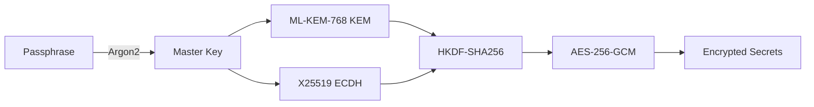

# Defense of the Artifacts (dota)

Post-quantum secure secrets manager with hybrid ML-KEM-768 + X25519 encryption and a terminal UI.

**Defense-in-depth cryptography**: Protects secrets against both classical attacks (X25519) and future quantum computers (ML-KEM-768). If one algorithm breaks, the other maintains security.

## Quickstart

```bash
# Install
cargo install --path .

# Initialize vault (stores in ~/.local/share/dota/vault.dota by default)
dota init

# Launch TUI (default command)
dota

# Or use CLI commands
dota set API_KEY "secret-value"
dota get API_KEY
dota list
```

## How it works



**Hybrid KEM**: Each secret is encrypted with AES-256-GCM. The AES key is derived by combining:
1. ML-KEM-768 (post-quantum KEM) shared secret
2. X25519 (classical ECDH) shared secret
3. HKDF-SHA256 for domain separation

The vault stores ML-KEM ciphertexts, X25519 ephemeral public keys, and AES-GCM ciphertexts. Only someone with your passphrase can decrypt the master keypair and recover secrets.

## Features

- **Post-quantum security**: ML-KEM-768 (NIST FIPS 203 final standard)
- **Classical security**: X25519 elliptic curve Diffie-Hellman
- **Memory safety**: Rust with zeroization of sensitive data
- **Key rotation**: `dota rotate-keys` re-encrypts all secrets with new keypairs
- **Export to environment**: `dota export-env VAR1 VAR2` outputs shell-compatible format
- **TUI and CLI**: Interactive ratatui interface or scriptable commands

## Design constraints

- **Trust boundary**: Vault file must be protected at rest (use disk encryption)
- **Passphrase strength**: Argon2 with 19MiB memory, 2 iterations, 1 thread (OWASP recommendations)
- **No network**: All operations are local; no cloud sync or remote key escrow
- **Clipboard security**: Secrets copied to clipboard are cleared after 45 seconds (configurable via `DOTA_CLIPBOARD_TIMEOUT`)

## Security assumptions

- **Threat model**: Protects against passive adversaries with quantum computers (harvest-now-decrypt-later). Does not protect against active quantum adversaries or compromised endpoints.
- **Algorithm choices**: ML-KEM-768 for post-quantum resistance, X25519 for proven classical security, AES-256-GCM for authenticated encryption.
- **Side channels**: No explicit protection against timing or cache attacks (relies on constant-time implementations in dependencies).

<details>
<summary>Cryptographic details</summary>

### Key derivation

1. Passphrase → Argon2id (19MiB, 2 iterations, 1 thread, 32-byte output)
2. Master key → Split into ML-KEM seed (32 bytes) and X25519 seed (32 bytes)
3. Deterministic keypair generation from seeds

### Secret encryption

1. Generate ML-KEM-768 and X25519 keypairs
2. For each secret:
   - ML-KEM encapsulation → 32-byte shared secret + ciphertext
   - X25519 ephemeral DH → 32-byte shared secret + ephemeral public key
   - HKDF-SHA256(kem_ss || x25519_ss, salt, context) → 32-byte AES key
   - AES-256-GCM(plaintext, aes_key, random_nonce) → ciphertext + tag

### Vault format

JSON structure with versioning (current: v2):
- `version`: Protocol version for forward compatibility
- `crypto`: Argon2 parameters and keypair metadata
- `secrets`: Map of name → (kem_ct, x25519_ephem_pk, aes_ct, nonce, tag, timestamp)

</details>

## Commands

```
dota init                   Initialize new vault
dota unlock                 Launch TUI (default command)
dota set <NAME> <VALUE>     Store a secret
dota get <NAME>             Retrieve a secret (copies to clipboard)
dota list                   List all secret names
dota rm <NAME>              Remove a secret
dota export-env [NAMES...]  Export secrets as shell variables
dota change-passphrase      Update vault passphrase
dota rotate-keys            Re-encrypt all secrets with new keypairs
dota info                   Show vault metadata
```

<details>
<summary>TUI shortcuts</summary>

- `j/k` or `↑/↓`: Navigate secrets list
- `Enter`: Copy secret to clipboard
- `n`: Create new secret (prompts for name and value)
- `e`: Edit selected secret
- `d`: Delete selected secret (requires confirmation)
- `r`: Rotate all encryption keys
- `q`: Quit

</details>

## Troubleshooting

- **"Failed to decrypt vault"**: Incorrect passphrase or corrupted vault file. Check `~/.local/share/dota/vault.dota`.
- **Clipboard not working**: Requires X11/Wayland display on Linux, or macOS/Windows clipboard access. Check `DISPLAY` environment variable.
- **Slow unlock**: Argon2 intentionally uses 19MiB RAM and 2 iterations. Adjust parameters in vault metadata only if you understand the security tradeoffs.

## Development

```bash
# Run tests
cargo test

# Run with debug logging
RUST_LOG=debug cargo run

# Build optimized release binary
cargo build --release
```

## License

MIT

## Citation

If you use this in research or security audits:

```bibtex
@software{dota2026,
  author = {Fitch, Zack},
  title = {Defense of the Artifacts: Post-quantum secure secrets manager},
  year = {2026},
  url = {https://github.com/johnzfitch/dota}
}
```
