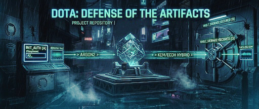
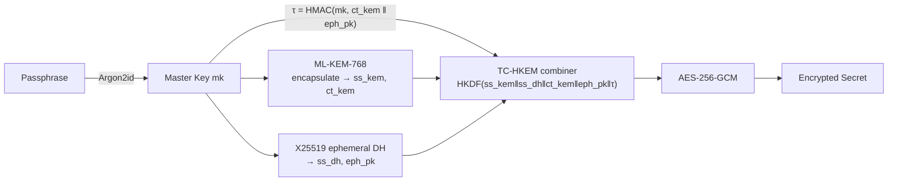

# Defense of the Artifacts (dota)
    

</p>

Post-quantum secure secrets manager with `v7` <abbr title="Triple-Committed Hybrid Key Encapsulation Mechanism">TC-HKEM</abbr> vaults (<abbr title="Module Lattice-based Key Encapsulation Mechanism, 768-bit security level, NIST FIPS 203">ML-KEM-768</abbr> + X25519 with ciphertext binding and passphrase commitment), plus a terminal UI.

**Defense-in-depth cryptography**: `v7` vaults protect secrets with both classical security (X25519) and post-quantum security (ML-KEM-768), combined via the TC-HKEM (Triple-Committed Hybrid KEM) construction. Security holds if *either* algorithm is secure. Legacy `v1`&ndash;`v6` vaults are migrated in place to `v7` on unlock.

## Quickstart

```bash
# Install
cargo install --path .

# Initialize vault (stored at ~/.dota/vault.json by default)
dota init

# Launch TUI (default command)
dota

# Or use CLI commands (the value is read from stdin or a non-echoing prompt,
# never from argv — argv is visible to other local processes)
printf 'secret-value' | dota set API_KEY
dota get API_KEY            # prints to stdout
dota get API_KEY --copy    # copies to the clipboard instead, auto-clears
dota list
```

## How it works


```mermaid
flowchart LR
    A[Passphrase] -->|Argon2id| B[Master Key mk]
    B --> C["ML-KEM-768\nencapsulate → ss_kem, ct_kem"]
    B --> D["X25519 ephemeral DH\n→ ss_dh, eph_pk"]
    B -->|"τ = HMAC(mk, ct_kem ‖ eph_pk)"| E
    C --> E["TC-HKEM combiner\nHKDF(ss_kem‖ss_dh‖ct_kem‖eph_pk‖τ)"]
    D --> E
    E --> F["AES-256-GCM"]
    F --> G[Encrypted Secret]
```

**TC-HKEM**: Each secret is encrypted with <abbr title="Advanced Encryption Standard, 256-bit key, Galois/Counter Mode with authentication">AES-256-GCM</abbr>. The per-secret AES key is derived via the Triple-Committed Hybrid KEM combiner:

1. <abbr title="Module Lattice-based Key Encapsulation Mechanism, NIST FIPS 203">ML-KEM-768</abbr> encapsulation &rarr; 32-byte shared secret (`ss_kem`) + ciphertext (`ct_kem`)
2. X25519 ephemeral <abbr title="Diffie-Hellman key exchange">DH</abbr> &rarr; 32-byte shared secret (`ss_dh`) + ephemeral public key (`eph_pk`)
3. Passphrase commitment: &tau; = `HMAC-SHA256(mk, ct_kem ‖ eph_pk)`
4. Ciphertext binding: `ct_kem` and `eph_pk` are included directly in the <abbr title="HMAC-based Key Derivation Function">HKDF</abbr> input
5. `HKDF-SHA256(ss_kem ‖ ss_dh ‖ ct_kem ‖ eph_pk ‖ τ, "dota-v7-tchkem-salt", "dota-v7-secret-key")` &rarr; 32-byte AES key

The vault stores ML-KEM ciphertexts, X25519 ephemeral public keys, and AES-GCM ciphertexts. A canonical authenticated header is protected by HMAC-SHA256 under the passphrase-derived master key before any private-key decryption occurs. The `v7` TC-HKEM combiner achieves best-of-both-worlds IND-CCA security and binds the passphrase into every per-secret key derivation.

## Features

<dl>
  <dt><mark>Post-quantum security</mark></dt>
  <dd>Real ML-KEM-768 (NIST FIPS 203 final standard) — resists quantum computer attacks.</dd>

  <dt>Classical security</dt>
  <dd>X25519 elliptic curve Diffie-Hellman — protects against classical adversaries.</dd>

  <dt>Best-of-both-worlds IND-CCA</dt>
  <dd>TC-HKEM ciphertext binding ensures security if <em>either</em> algorithm holds (GHP18 reduction).</dd>

  <dt>Passphrase commitment</dt>
  <dd>Master key <code>mk</code> is bound into every per-secret key derivation via &tau;&nbsp;=&nbsp;HMAC(<code>mk</code>,&nbsp;<code>ct_kem&nbsp;‖&nbsp;eph_pk</code>). Knowledge of the KEM private keys alone is insufficient.</dd>

  <dt>Memory safety</dt>
  <dd>Rust with <code>ZeroizeOnDrop</code> on all sensitive types — passphrases, shared secrets, and AES keys are wiped when their wrappers drop on the normal return path. The release profile uses <code>panic = "abort"</code> for fail-fast behavior, so drop glue does <em>not</em> run on panic; <code>harden_process</code> compensates by disabling core dumps (<code>RLIMIT_CORE = 0</code>), blocking ptrace (<code>PR_SET_DUMPABLE = 0</code>), and pinning all pages with <code>mlockall</code> so freed pages cannot be observed by a same-UID process or written to swap, and the Linux page allocator zeros pages before handing them to the next process.</dd>

  <dt>Authenticated metadata</dt>
  <dd><code>version</code>, <code>min_version</code>, algorithm IDs, public keys, and <code>suite</code> are covered by the <code>v7</code> HMAC-SHA256 key commitment before any private-key decryption.</dd>

  <dt>Automatic migration</dt>
  <dd>Legacy <code>v1</code>&ndash;<code>v6</code> vaults upgrade to <code>v7</code> on unlock; originals are backed up automatically.</dd>

  <dt>Key rotation</dt>
  <dd><kbd>dota rotate-keys</kbd> generates fresh ML-KEM-768 and X25519 keypairs and re-encrypts all secrets.</dd>

  <dt>Export to environment</dt>
  <dd><kbd>dota export-env VAR1 VAR2</kbd> outputs shell-compatible variable assignments for CI/CD pipelines.</dd>

  <dt>Clipboard with auto-clear</dt>
  <dd><kbd>dota get NAME --copy</kbd> (and <kbd>copy NAME</kbd> in the shell) places the secret on the system clipboard and clears it automatically after a short delay, keeping it out of terminal scrollback and shell logs. Requires a desktop session.</dd>

  <dt>Interactive shell and CLI</dt>
  <dd>A scriptable command-line interface plus a minimal interactive <code>dota&gt;</code> shell (the default when no subcommand is given).</dd>
</dl>

## Design constraints

<dl>
  <dt>Trust boundary</dt>
  <dd>The vault file must be protected at rest. Use full-disk encryption (<abbr title="Linux Unified Key Setup">LUKS</abbr>, FileVault, BitLocker) or store on an encrypted volume.</dd>

  <dt>Passphrase strength</dt>
  <dd>Argon2id with 64&nbsp;MiB memory, 3 iterations, 4 threads (OWASP 2024 recommended parameters). Adjust only if you understand the security tradeoffs.</dd>

  <dt>No network</dt>
  <dd>All operations are fully local. There is no cloud sync, remote key escrow, or telemetry.</dd>
</dl>

## Security assumptions

<dl>
  <dt>Threat model</dt>
  <dd>Protects against passive adversaries with quantum computers (harvest-now-decrypt-later attacks). Does <strong>not</strong> protect against active quantum adversaries or compromised endpoints.</dd>

  <dt>Algorithm choices</dt>
  <dd><code>v7</code> uses ML-KEM-768 (post-quantum), X25519 (classical), AES-256-GCM (authenticated encryption), HKDF-SHA256 (TC-HKEM combiner), and HMAC-SHA256 (header commitment + passphrase binding).</dd>

  <dt>Side channels</dt>
  <dd>No explicit protection against timing or cache attacks beyond what the underlying cryptography libraries provide.</dd>

  <dt>Metadata exposure</dt>
  <dd>Secret <em>names</em> and their <code>created</code>/<code>modified</code> timestamps are stored in plaintext inside the vault file; only the secret <em>values</em> are encrypted. Treat the vault file as confidential at rest (full-disk encryption is the recommended container). Anyone who can read the file learns which secrets exist and when they last changed, even without the passphrase.</dd>

  <dt>Secret output</dt>
  <dd><kbd>dota get NAME</kbd> prints the value to stdout, which lands in terminal scrollback, <code>script(1)</code> captures, and multiplexer history. Use <kbd>dota get NAME --copy</kbd> for interactive retrieval and reserve plain <kbd>get</kbd> for pipelines.</dd>

  <dt>Non-interactive passphrase</dt>
  <dd>Every command reads the unlock passphrase from <code>DOTA_PASSPHRASE</code> when it is set, falling back to a non-echoing prompt. This is convenient for CI, but an environment variable is visible to same-UID processes via <code>/proc/&lt;pid&gt;/environ</code> and to anything holding <code>CAP_SYS_PTRACE</code>. Set it only in non-interactive contexts and unset it afterwards.</dd>

  <dt>Process hardening is Linux-only</dt>
  <dd>Core-dump suppression, <code>PR_SET_DUMPABLE = 0</code>, and <code>mlockall</code> are applied on Linux only. On macOS and Windows, <code>dota</code> runs with default OS process protections.</dd>

  <dt>Migration backups and re-keying</dt>
  <dd>Upgrading a legacy vault writes a timestamped <code>*.backup.*.json</code> alongside it. <kbd>dota change-passphrase</kbd> and <kbd>dota rotate-keys</kbd> scrub these into hollowed <code>*.tombstone.*.json</code> files (private keys, key commitment, and secrets nulled; non-secret metadata kept) and best-effort shred the originals. On copy-on-write filesystems (btrfs, ZFS, APFS) the shredded bytes may persist on the underlying media; use full-disk encryption and, if needed, <code>shred(1)</code> on the device.</dd>
</dl>

<details>
<summary>Cryptographic details</summary>

### Key derivation

1. Passphrase &rarr; Argon2id (64&nbsp;MiB, 3 iterations, 4 threads, 32-byte master key `mk`)
2. `mk` &rarr; purpose-labeled wrapping keys for encrypting the ML-KEM-768 and X25519 private keys, HMAC-SHA256 header commitment, and TC-HKEM passphrase commitment &tau;
3. ML-KEM-768 and X25519 keypairs are generated from `OsRng` and stored encrypted in the vault (no deterministic derivation from `mk`)

### Secret encryption (TC-HKEM)

```
1. ML-KEM-768 encapsulate(pk_kem)  → (ss_kem, ct_kem)
2. X25519 ephemeral DH(pk_x25519)  → (ss_dh, eph_pk)
3. τ = HMAC-SHA256(mk, ct_kem ‖ eph_pk)
4. IKM = ss_kem ‖ ss_dh ‖ ct_kem ‖ eph_pk ‖ τ    (≈ 1216 bytes for ML-KEM-768)
5. aes_key = HKDF-SHA256(IKM, "dota-v7-tchkem-salt", "dota-v7-secret-key")
6. (ciphertext, tag) = AES-256-GCM(plaintext, aes_key, random_nonce)
```

**Security properties:**

- **Theorem 1** &mdash; Best-of-both-worlds IND-CCA: `Adv ≤ Adv_ML-KEM^{ind-cca}(B₁) + Adv_X25519^{gap-cdh}(B₂) + q_H/2^256`. Ciphertext binding enables the B₁ reduction.
- **Theorem 2** &mdash; Passphrase binding: `Adv^{mk-bind} ≤ Adv_HMAC^{prf}(B₃) + q_H/2^256`. Knowledge of `(dk, sk_dh)` alone is insufficient without `mk`.

### Vault format

JSON structure with versioning (current: `v7`, suite: `dota-v7-tchkem-mlkem768-x25519-aes256gcm`):

<dl>
  <dt><code>version</code></dt>
  <dd>Protocol version for forward compatibility. Current: <code>7</code>.</dd>

  <dt><code>min_version</code></dt>
  <dd>Anti-rollback floor — vault is rejected by implementations older than this version.</dd>

  <dt><code>kdf</code></dt>
  <dd>Argon2id parameters: algorithm, salt, time_cost, memory_cost, parallelism.</dd>

  <dt><code>key_commitment</code></dt>
  <dd>HMAC-SHA256 over the canonical header (version, min_version, KDF params, algorithm IDs, public keys, suite). Verified before any private-key decryption.</dd>

  <dt><code>kem</code></dt>
  <dd>ML-KEM-768 public key and AES-256-GCM-wrapped private key.</dd>

  <dt><code>x25519</code></dt>
  <dd>X25519 public key, algorithm label, and AES-256-GCM-wrapped private key.</dd>

  <dt><code>suite</code></dt>
  <dd>Active cipher-suite identifier: <code>dota-v7-tchkem-mlkem768-x25519-aes256gcm</code>.</dd>

  <dt><code>secrets</code></dt>
  <dd>Map of name &rarr; <code>{algorithm, kem_ciphertext, x25519_ephemeral_public, ciphertext, nonce, created, modified}</code>.</dd>

  <dt><code>migrated_from</code></dt>
  <dd>Original version and migration path for vaults upgraded from older formats.</dd>
</dl>

</details>

## Commands

<dl>
  <dt><kbd>dota init</kbd></dt>
  <dd>Initialize a new vault at <code>~/.dota/vault.json</code> (or <code>--vault PATH</code>).</dd>

  <dt><kbd>dota</kbd> &nbsp;/&nbsp; <kbd>dota unlock</kbd></dt>
  <dd>Launch the interactive TUI (default command when no subcommand is given).</dd>

  <dt><kbd>dota set <var>NAME</var> <var>VALUE</var></kbd></dt>
  <dd>Store or update a secret. Omit <var>VALUE</var> to read from stdin or an interactive prompt.</dd>

  <dt><kbd>dota get <var>NAME</var> [<kbd>--copy</kbd>]</kbd></dt>
  <dd>Print a secret value to stdout, or with <kbd>--copy</kbd> place it on the clipboard (auto-cleared after a short delay) instead.</dd>

  <dt><kbd>dota list</kbd></dt>
  <dd>List all secret names (values are never printed).</dd>

  <dt><kbd>dota rm <var>NAME</var></kbd></dt>
  <dd>Permanently remove a secret.</dd>

  <dt><kbd>dota export-env [<var>NAMES</var>&hellip;]</kbd></dt>
  <dd>Print <code>export KEY=VALUE</code> lines for the named secrets (or all secrets if no names given). Safe to <code>eval</code> in shell scripts.</dd>

  <dt><kbd>dota change-passphrase</kbd></dt>
  <dd>Re-derive the master key and re-wrap all private key material under a new passphrase.</dd>

  <dt><kbd>dota rotate-keys</kbd></dt>
  <dd>Generate fresh ML-KEM-768 and X25519 keypairs and re-encrypt all secrets.</dd>

  <dt><kbd>dota upgrade</kbd></dt>
  <dd>Explicitly migrate the vault to the current format version (<code>v7</code>). Migration also happens automatically on any unlock.</dd>

  <dt><kbd>dota info</kbd></dt>
  <dd>Show vault metadata: version, suite, KDF parameters, key commitment status, and secret count.</dd>
</dl>

All commands accept <kbd>--vault <var>PATH</var></kbd> to override the default vault location.

<details>
<summary>Interactive shell commands</summary>

Running <kbd>dota</kbd> (or <kbd>dota unlock</kbd>) prompts for the passphrase and
drops into a minimal <code>dota&gt;</code> shell:

<dl>
  <dt><kbd>list</kbd></dt>
  <dd>List secret names with their last-modified timestamps.</dd>

  <dt><kbd>get <var>NAME</var></kbd></dt>
  <dd>Print a secret value.</dd>

  <dt><kbd>copy <var>NAME</var></kbd></dt>
  <dd>Copy a secret to the clipboard; it clears automatically after a short delay.</dd>

  <dt><kbd>set <var>NAME</var></kbd></dt>
  <dd>Set or update a secret; the value is read from a non-echoing prompt (never inline).</dd>

  <dt><kbd>rm <var>NAME</var></kbd></dt>
  <dd>Remove a secret.</dd>

  <dt><kbd>info</kbd></dt>
  <dd>Show vault metadata.</dd>

  <dt><kbd>refresh</kbd></dt>
  <dd>Reload the vault from disk.</dd>

  <dt><kbd>export</kbd></dt>
  <dd>Print <code>export KEY=VALUE</code> lines for all secrets.</dd>

  <dt><kbd>help</kbd></dt>
  <dd>Show the command list.</dd>

  <dt><kbd>quit</kbd> &nbsp;/&nbsp; <kbd>exit</kbd></dt>
  <dd>Leave the shell.</dd>
</dl>

</details>

## Troubleshooting

- **<samp>Failed to decrypt vault</samp>**: Incorrect passphrase or corrupted vault file. Check `~/.dota/vault.json`.
- **Slow unlock**: Argon2id intentionally uses 64&nbsp;MiB RAM and 3 iterations with 4 threads. This takes roughly 1&ndash;3 seconds on modern hardware and is by design.

## Development

```bash
# Run all tests
cargo test

# Run with debug logging
RUST_LOG=debug cargo run

# Check formatting and lints
cargo fmt --check && cargo clippy

# Build optimized release binary
cargo build --release

# Build without legacy (v1-v5) migration support, dropping the pre-FIPS
# pqcrypto-kyber dependency. Only do this once all your vaults are v6+.
cargo build --release --no-default-features

# Supply-chain checks (licenses, sources, bans) in addition to the RustSec audit
cargo deny check
```

## License

MIT

## Citation

If you use this in research or security audits:

```bibtex
@software{dota2026,
  author = {Fitch, Zack},
  title = {Defense of the Artifacts: Post-quantum secure secrets manager},
  year = {2026},
  url = {https://github.com/johnzfitch/dota}
}
```
