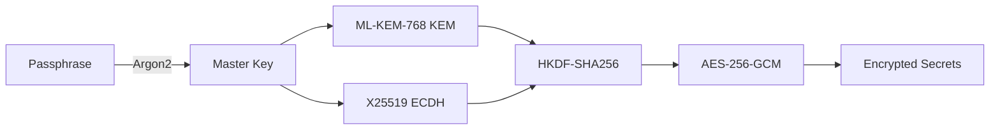

# Defense of the Artifacts (dota)

Post-quantum secure secrets manager with `v6` vaults written under real FIPS 203 ML-KEM-768 + X25519, plus a terminal UI.

**Defense-in-depth cryptography**: `v6` vaults protect secrets with both classical security (X25519) and post-quantum security (ML-KEM-768). Legacy `v1-v5` vaults remain readable and are migrated in place to `v6` on unlock.

## Quickstart

```bash
# Install
cargo install --path .

# Initialize vault (stores in ~/.local/share/dota/vault.dota by default)
dota init

# Launch TUI (default command)
dota

# Or use CLI commands
dota set API_KEY "secret-value"
dota get API_KEY
dota list
```

## How it works


```mermaid
flowchart LR
    A[Passphrase] -->|Argon2| B[Master Key]
    B --> C["ML-KEM-768 KEM"]
    B --> D["X25519 ECDH"]
    C --> E["HKDF-SHA256"]
    D --> E
    E --> F["AES-256-GCM"]
    F --> G[Encrypted Secrets]
```

**Hybrid KEM**: Each secret is encrypted with AES-256-GCM. The per-secret AES key is derived by combining:
1. ML-KEM-768 (post-quantum KEM) shared secret
2. X25519 (classical ECDH) shared secret
3. HKDF-SHA256 with `v6` domain-separated labels

The vault stores ML-KEM ciphertexts, X25519 ephemeral public keys, and AES-GCM ciphertexts. A canonical authenticated header is protected by HMAC-SHA256 under the passphrase-derived master key before any private-key decryption occurs.

## Features

- **Post-quantum security**: Real ML-KEM-768 (NIST FIPS 203 final standard)
- **Classical security**: X25519 elliptic curve Diffie-Hellman
- **Memory safety**: Rust with zeroization of sensitive data
- **Authenticated metadata**: `version`, `min_version`, algorithm ids, public keys, and suite are covered by the `v6` key commitment
- **Automatic migration**: Legacy `v1-v5` vaults upgrade to `v6` on unlock
- **Key rotation**: `dota rotate-keys` re-encrypts all secrets with new keypairs
- **Export to environment**: `dota export-env VAR1 VAR2` outputs shell-compatible format
- **TUI and CLI**: Interactive ratatui interface or scriptable commands

## Design constraints

- **Trust boundary**: Vault file must be protected at rest (use disk encryption)
- **Passphrase strength**: Argon2id with 64 MiB memory, 3 iterations, 4 threads (OWASP 2024 recommended parameters)
- **No network**: All operations are local; no cloud sync or remote key escrow

## Security assumptions

- **Threat model**: Protects against passive adversaries with quantum computers (harvest-now-decrypt-later). Does not protect against active quantum adversaries or compromised endpoints.
- **Algorithm choices**: `v6` uses ML-KEM-768 for post-quantum resistance, X25519 for classical security, AES-256-GCM for authenticated encryption, HKDF-SHA256 for the hybrid secret combiner, and HMAC-SHA256 for authenticated header commitment.
- **Side channels**: No explicit protection against timing or cache attacks (relies on constant-time implementations in dependencies).

<details>
<summary>Cryptographic details</summary>

### Key derivation

1. Passphrase → Argon2id (64 MiB, 3 iterations, 4 threads, 32-byte master key)
2. Master key → Used to encrypt vault key material and authenticate the `v6` header commitment
3. ML-KEM-768 and X25519 keypairs are generated randomly and stored encrypted in the vault (no deterministic derivation from the master key)

### Secret encryption

1. Generate static ML-KEM-768 and X25519 recipient keypairs
2. For each secret:
   - ML-KEM encapsulation → 32-byte shared secret + ciphertext
   - X25519 ephemeral DH → 32-byte shared secret + ephemeral public key
   - HKDF-SHA256(kem_ss || x25519_ss, `dota-v6-hkdf-salt`, `dota-v6-secret`) → 32-byte AES key
   - AES-256-GCM(plaintext, aes_key, random_nonce) → ciphertext + tag

### Vault format

JSON structure with versioning (current: v6):
- `version`: Protocol version for forward compatibility
- `kdf`: Argon2id parameters
- `key_commitment`: authenticated header commitment
- `kem`: ML-KEM-768 public key and encrypted private key
- `x25519`: X25519 public key, algorithm id, and encrypted private key
- `suite`: active cipher-suite identifier
- `secrets`: map of name → (`algorithm`, `kem_ciphertext`, `x25519_ephemeral_public`, `ciphertext`, `nonce`, timestamps)
- `migrated_from`: original version and migration path for upgraded vaults
- `min_version`: authenticated anti-rollback floor

</details>

## Commands

```
dota init                   Initialize new vault
dota unlock                 Launch TUI (default command)
dota set <NAME> <VALUE>     Store a secret
dota get <NAME>             Retrieve a secret
dota list                   List all secret names
dota rm <NAME>              Remove a secret
dota export-env [NAMES...]  Export secrets as shell variables
dota change-passphrase      Update vault passphrase
dota rotate-keys            Re-encrypt all secrets with new keypairs
dota info                   Show vault metadata
```

<details>
<summary>TUI shortcuts</summary>

- `j/k` or `↑/↓`: Navigate secrets list
- `Enter`: Copy secret to clipboard
- `n`: Create new secret (prompts for name and value)
- `e`: Edit selected secret
- `d`: Delete selected secret (requires confirmation)
- `r`: Rotate all encryption keys
- `q`: Quit

</details>

## Troubleshooting

- **"Failed to decrypt vault"**: Incorrect passphrase or corrupted vault file. Check `~/.local/share/dota/vault.dota`.
- **Slow unlock**: Argon2id intentionally uses 64 MiB RAM and 3 iterations with 4 threads. Adjust parameters in vault metadata only if you understand the security tradeoffs.

## Development

```bash
# Run tests
cargo test

# Run with debug logging
RUST_LOG=debug cargo run

# Build optimized release binary
cargo build --release
```

## License

MIT

## Citation

If you use this in research or security audits:

```bibtex
@software{dota2026,
  author = {Fitch, Zack},
  title = {Defense of the Artifacts: Post-quantum secure secrets manager},
  year = {2026},
  url = {https://github.com/johnzfitch/dota}
}
```
